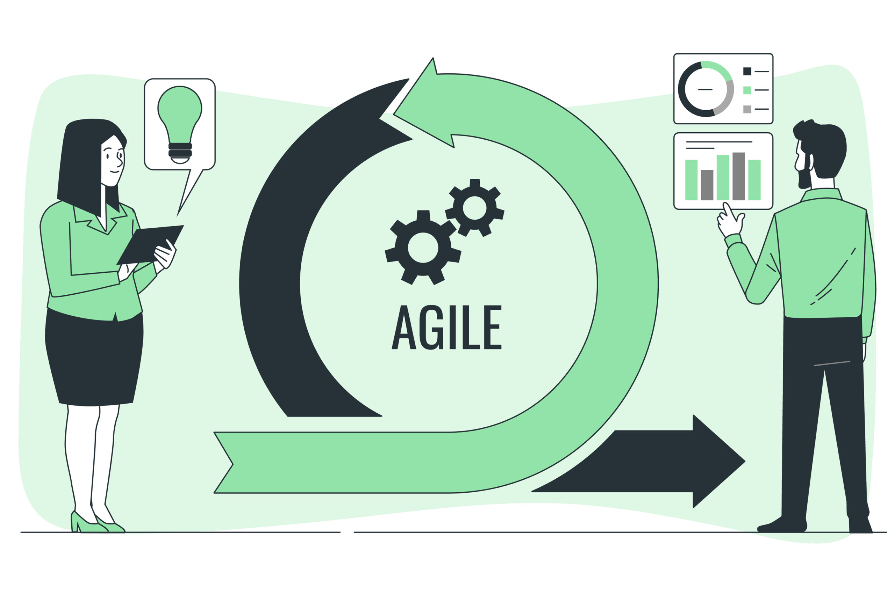

# 👩🏻‍💻 Henrique Borges dos Santos

**`Desenvolvedora FullStack`**

Olá, me chamo Henrique Borges dos Santos, tenho 21 anos e moro em Rio do Sul, SC. Fiz o curso técnico de Informática no ensino médio pelo IFC e atualmente estou cursando o último semestre de Ciência da Computação na mesma instituição, com minha formatura se aproximando. Desenvolvo desde 2019, mas comecei a atuar profissionalmente em 2021. Tenho um grande interesse em criar pacotes, ferramentas e bibliotecas que facilitem o trabalho de outros desenvolvedores.

---

### 🤖 Linguagens e Tecnologias

 
 

### 🚀 Principais Projetos

| **Agilmine**                                                                                          | **Router**                                                                                         | **TestCraft**                                                                                          |
|-------------------------------------------------------------------------------------------------------|----------------------------------------------------------------------------------------------------|--------------------------------------------------------------------------------------------------------|
|                         |                        |                         |
| Software de gestão de projetos utilizando metodologias ágeis. Extensão do *Redmine*, permite gerenciar projetos criando *sprints*, *backlogs* e relatórios. | Componente PHP para controle de rotas em aplicações, oferecendo flexibilidade e simplicidade no roteamento. | Pacote para Laravel que facilita a criação de classes de teste para controllers *resource*, com geração automática de testes via terminal. |
|    |    |    |
| 📂 [Repositório](https://github.com/HenriqueBS0/agilmine)   🌠[Demonstração](http://agilmine.henriquebs0.site/) | 📂 [Repositório](https://github.com/HenriqueBS0/router)   📦 [Packagist](https://packagist.org/packages/henriquebs0/router) | 📂 [Repositório](https://github.com/fabtec-ifc/testcraft)   📦 [Packagist](https://packagist.org/packages/fabtec/test-craft) |

| **MULTITHREADING — BUSCA EM GRAFOS**                                                                  | **Biblioteca Java para a criação de banco de dados**                                               |
|-------------------------------------------------------------------------------------------------------|----------------------------------------------------------------------------------------------------|
|                  |               |
| Implementação eficiente de busca em grafos utilizando *multithreading* para paralelismo e desempenho superior. | Biblioteca em Java que permite a criação de bases de dados a partir de documentos JSON, aplicando princípios de POO e padrões de projeto. |
|    |    |
| 📂 [Repositório](https://github.com/HenriqueBS0/busca-grafo-multithread)   📠[Artigo](https://medium.com/@henrique.10agr/multithreading-busca-em-grafos-7df3103fe723) | 📂 [Repositório](https://github.com/HenriqueBS0/biblioteca-criacao-banco-dados)   📠[Artigo](https://medium.com/@henrique.10agr/biblioteca-java-para-a-cria%C3%A7%C3%A3o-de-banco-de-dados-bd5b23f4e129) |

 
 

### 📊 Estatísticas

  

